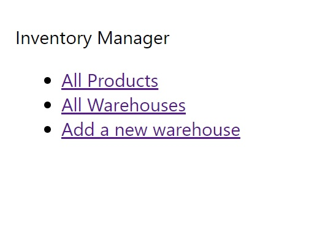
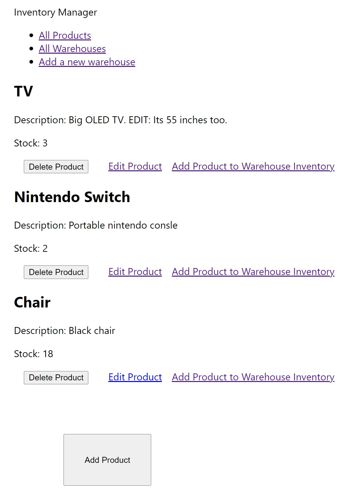
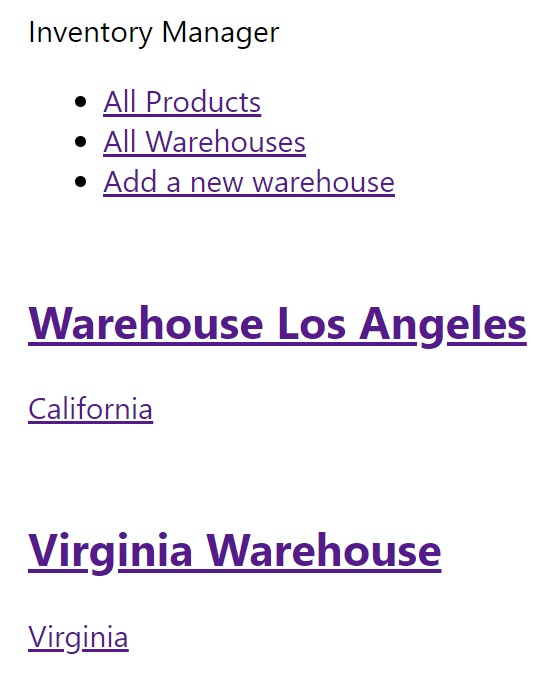
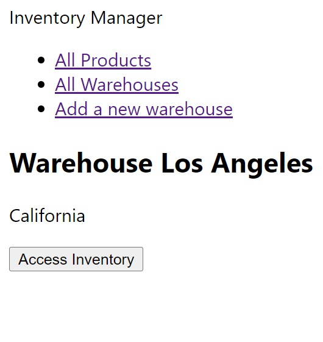
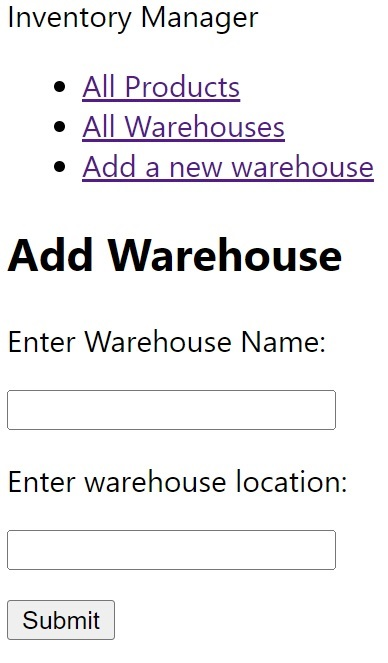

# Inventory-tracking-frontend

This application allows you to Add inventory to a database. It will also allow you to manage this inventory in case you need to edit it, send stock to a warehouse, or simply delete it.

The application will also allow you to manage your warehouses, and add inventory to each warehouse.

## How to run the web app

This app is designed to run on Replit. 

## Main Page

The main page will present 3 options:

* All Products - This page displays all products in the database, the amount of stock remaining for each product, and options to manage the inventory.
* All Warehouses - Display all warehouses in the database, as well as an option to access the inventory for a specific warehouse.
* Add a warehouse - Displays a form where you can add a new warehouse.

It will look like this:

## All Products

It displays all the products in the global products inventory. It shows the remaining stock for each product. It does not include the stock that was already assigned to a specific warehouse. 

It will look like this:

Under each product, you will find 3 options:

* Delete Product. It instantly deletes the product from the database.
* Edit Product. Takes you to a form that you can fill out with the new information.
* Add Product to the Warehouse Inventory. You can assign the product to any inventory in the database. 

Finally, at the end there is an "Add Product", which will open a form you can fill out.

## All Warehouses

It displays a list of all warehouses in the database. It looks like this:

You can click each warehouse which will give you the option to see its inventory:

The inventory will display a list of products, similar to the list displayed in the "All Products" page. Keep in mind, the stock showed in this warehouse inventory list will display the stock that is specifically assigned to this warehouse. 

## Add Warehouse Page

This page displays a form you can submit, which will add a new warehouse to the database.

